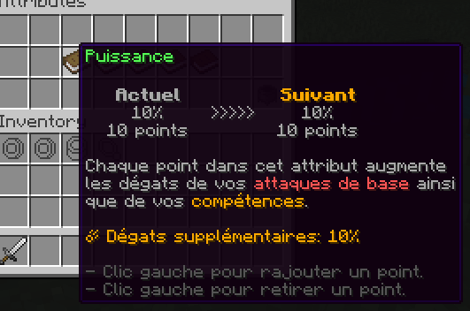

# PAPI Expansion | Text Padding

## Presentation

Minecraft item lores provide no functionality to align or center text.
This expansion provides placeholders to pad text with custom spaces to achieve left, right, and center alignment.
Furthermore,
the length in pixels of a text cannot be precisely determined server side as it depends on the font used by the client.

If a server resource pack is used, we can make assumptions about the character sizes to predict the length of a text,
and use positive/negative space characters to center a text.
This expansion does just that.

<details>

<summary>In-Game Example</summary>

The three lines `Actuel`, `10%` and `10 points` are centered in a 70-pixels-wide fictive div. 
With proper use of the placeholders you can have multiple
of these horizontal/vertical blocks next to each other to simulate complex page layouts.



```yml
# Taken from a config from the MMOCore plugin
lore:
  - '&7%pad_centerl_70_36_&7&lActuel&7%%pad_space_25%%pad_centerl_70_42_&6&lSuivant&6%'
  - '&7%pad_center_70_{mmocore_stat_weapon_damage}[prc]%>>>>>%pad_center_70_{mmocore_stat_weapon_damage}[prc]%'
  - '&7%pad_center_70_{total} points%%pad_space_25%%pad_center_70_{total} points%'
```

</details>

## Usage

| Placeholder                                  | Usage                                                                                               |     
|----------------------------------------------|-----------------------------------------------------------------------------------------------------|
| `%pad_center_<total>_<text>%`                | Centers the text in a space of total width `<total>`. Text length is calculated automatically.      |
| `%pad_left_<total>_<text>%`                  | Left-aligns the text in a space of total width `<total>`. Text length is calculated automatically.  |
| `%pad_right_<total>_<text>%`                 | Right-aligns the text in a space of total width `<total>`. Text length is calculated automatically. |
| `%pad_centerl_<total>_<text_length>_<text>%` | Centers the text in a space of total width `<total>`. Text length is provided.                      |
| `%pad_space_<size>%`                         | Provides a custom font with positive/negative space, from -8192 to +8192                            |
| `%pad_space_<size>%`                         | Provides a custom font with positive/negative space, from -8192 to +8192                            |
| `%pad_len_<text>%`                           | Returns the size in pixels of provided text, useful for debugging.                                  |


## Installation

Compile this expansion and install the JAR file inside your `./plugins/PlaceholderAPI/expansions` folder.

## Configuration

<details>

<summary>Default Config</summary>

```yml
# PlaceholderAPI/config.yml
expansions:
  #.........
  pad:
    CharSizes:
      - f4
      - i1
      - k4
      - l2
      - t3
      - I3
      - '''1'
      - ' 3'
      - ',1'
      - (3
      - )3
    DefaultCharSize: 5
    NegativeSpaceBaseChar: 851968

```

</details>

In order to properly compute the length in pixels of any text,
you need to specify the length in pixels of every character that you will use inside the padding placeholders.
In the PAPI `config.yml` file, you can specify the default char size `DefaultCharSize`,
used for any character not explicitly defined.
You can also define specific character sizes inside the `CharSizes` list.

For the vanilla Minecraft font, most characters are 5-pixels wide,
with some exceptions like the ` ` space character (3 pixels), or the `i` character
(1 pixel).

This expansion makes use of negative/positive space fonts. You can either install the same resource pack used to
develop this expansion, or modify the base character used to create the positive/negative space characters using the
config option `NegativeSpaceBaseChar`.

## Credits

Credits to the [negative space font resource pack](https://github.com/AmberWat/NegativeSpaceFont).

## License

This expansion is licensed under GPL-3.0. Long story short, you can use and modify this expansion. If you modify and redistribute it, you must also distribute your modified source code under the same license (GPL-3.0).